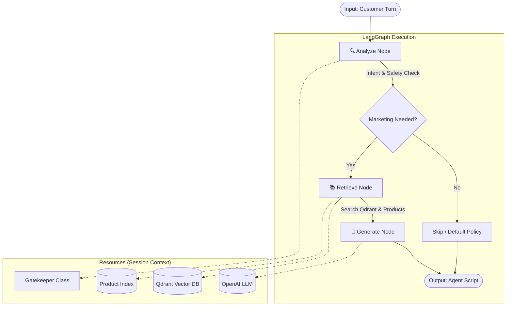

# Marketing Agent Architecture & Workflow

## 🏗️ Overview
Marketing Agent는 **LangGraph** 기반의 워크플로우를 통해 고객의 발화를 분석하고, 세일즈/마케팅 기회를 포착하여 최적의 제안을 생성합니다. 기존의 절차적 코드(`step()` 함수)를 그래프 기반으로 마이그레이션하여 **확장성**과 **모듈성**을 확보했습니다.

### 🔑 Key Concepts
- **StateGraph**: 전체 상담의 상태(`MarketingState`)를 관리하며 노드 간 데이터 전달.
- **Session Injection**: 무거운 리소스(Qdrant Client, Product DB)를 매번 생성하지 않고, `MarketingSession` 객체를 상태에 주입하여 재사용.
- **Hybrid Execution**: 새로운 `MarketingService`와 레거시 `Consumer` 모두 동일한 그래프 로직을 사용.

---

## 🔄 Workflow Diagram

---

## 🧩 Component Detail

### 1. State (`state.py`)
에이전트가 공유하는 메모리 구조입니다.
*   **`messages`**: 대화 기록 (LangChain BaseMessage).
*   **`session_context`**: `MarketingSession` 인스턴스 (리소스 접근용).
*   **`marketing_needed`**: 마케팅 개입 여부 (True/False).
*   **`product_candidates`**: 추천할 상품 후보 리스트.

### 2. Nodes (`nodes.py`)
각 단계별 로직이 독립된 함수로 구현되어 있습니다.

#### 🔍 Analyze Node
*   **역할**: 들어온 메시지가 안전한지(Safety), 마케팅 기회가 있는지(Intent) 판단.
*   **사용 리소스**: `Gatekeeper` (Regex + Fast LLM).
*   **출력**: `marketing_needed`, `marketing_type` (upsell/retention 등).

#### 📚 Retrieve Node
*   **역할**: 판단된 의도에 맞춰 마케팅 근거와 상품을 찾음.
*   **사용 리소스**:
    *   `session.build_query()`: 대화 내역 요약 쿼리 생성.
    *   `QdrantSearchEngine`: 약관, 가이드라인 검색.
    *   `ProductSearchIndex`: 요금제, 결합 상품 검색.

#### 🧠 Generate Node
*   **역할**: 검색된 정보와 고객 프로필을 종합하여 최종 멘트 생성.
*   **사용 리소스**: `OpenAICompatibleLLM`.
*   **로직**:
    1.  `session.build_system_prompt()`로 페르소나 설정.
    2.  검색 결과, 고객 정보, 대화 이력을 프롬프트에 주입.
    3.  JSON 포맷으로 의사결정(`decision`)과 스크립트(`agent_script`) 생성.

---

## 🚀 Execution Flow (코드 흐름)

### A. New Way (`MarketingService`)
1.  **FastAPI**가 `handle_marketing_message` 호출.
2.  `MarketingGraph.ainvoke(inputs)` 실행.
3.  그래프가 `Analyze -> Retrieve -> Generate` 순서로 실행되며 결과 반환.
4.  결과를 `Agent Manager` 포맷에 맞춰 전송.

### B. Legacy Way (`MarketingConsumer`)
1.  `Consumer`가 `session.step()` 호출.
2.  **Refactored `step()`**: 내부적으로 `MarketingGraph`를 생성하고 실행.
3.  그래프 실행 결과를 기존 `consumer`가 기대하는 딕셔너리 형태로 변환하여 반환.
4.  (즉, 레거시 코드도 내부적으로는 최신 그래프 로직을 사용함)

---

## 🧹 Refactoring Notes
*   **Code Cleanup**: 기존의 비대했던 `step()` 메서드 로직을 모두 그래프 노드(`nodes.py`)로 이관하고, `step()`은 단순한 래퍼(Wrapper)가 되었습니다.
*   **Access Control**: 내부 메서드였던 `_system_prompt`를 `build_system_prompt`로 변경하여 노드에서 안전하게 접근하도록 수정했습니다.
