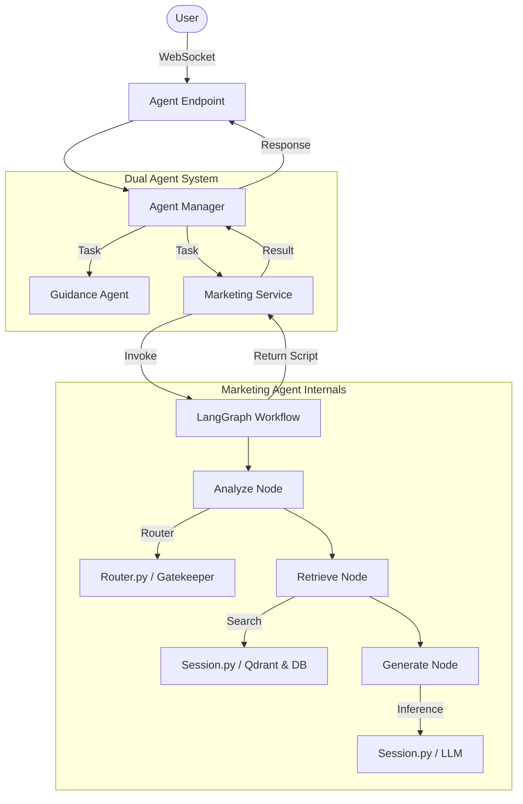

# Marketing Agent Architecture & Workflow

## 🏗️ Overview
Marketing Agent는 **LangGraph** 기반의 워크플로우를 통해 고객의 발화를 분석하고, 세일즈/마케팅 기회를 포착하여 최적의 제안을 생성합니다. 
기존의 절차적 코드(`step()` 함수)를 그래프 기반으로 마이그레이션하여 **확장성**과 **모듈성**을 확보했습니다.

---

## 📂 File Structure & Roles (파일별 역할 상세)

### 1. **Framework Layer (`app/services`, `app/api`)**
이 계층은 외부 요청을 에이전트의 내부 로직(`Graph`)으로 연결해주는 어댑터 역할을 합니다.

| 파일명 | 역할 및 설명 |
| :--- | :--- |
| **`app/api/v1/endpoints/agent.py`** | **[통합 진입점]** 클라이언트(WebSocket)로부터 모든 요청을 받아 `AgentManager`에게 전달합니다. |
| **`app/services/agent_manager.py`** | **[오케스트레이터]** `Guidance`와 `Marketing` 에이전트에게 동시에 작업을 시키고 결과를 취합합니다. |
| **`app/services/marketing_service.py`** | **[어댑터]** `AgentManager`의 요청을 받아 `MarketingGraph`를 실행(`ainvoke`)하고, 결과를 표준 포맷으로 변환합니다. |

### 2. **Core Logic Layer (`app/agent/marketing`)**
실질적인 AI 로직이 구현된 핵심 계층입니다. **LangGraph** 패턴을 따릅니다.

| 파일명 | 역할 및 설명 |
| :--- | :--- |
| **`graph.py`** | **[워크플로우 정의]** 상태(State)와 노드(Node)를 연결하여 실행 순서를 정의합니다. (`Analyze -> Retrieve -> Generate`) |
| **`nodes.py`** | **[실행 단위]** 각 단계별 구체적인 로직을 수행합니다. (예: 의도 분류, 검색, LLM 호출) |
| **`state.py`** | **[메모리 구조]** 그래프 실행 중에 에이전트가 공유하는 데이터 모델(`TypedDict`)입니다. |
| **`session.py`** | **[리소스 컨테이너]** Qdrant, OpenAI, 고객 DB 등 무거운 리소스를 초기화하고 관리합니다. 그래프 노드들은 이 객체(`session_context`)를 통해 리소스에 접근합니다. |
| **`prompts.py`** | **[프롬프트 저장소]** 상담원 페르소나, 마케팅 전략(Sales Strategy) 등 모든 시스템 프롬프트를 중앙에서 관리합니다. |

### 3. **Support Components (`app/agent/marketing`)**
핵심 로직을 보조하는 유틸리티 모듈들입니다.

| 파일명 | 역할 및 설명 |
| :--- | :--- |
| **`router.py`** | **[Gatekeeper]** 메시지의 안전성을 검사(욕설/비속어)하고, 마케팅 기회(Upsell/Retention)가 있는지 **Semantic Routing**을 수행합니다. |
| **`buffer.py`** | **[스트림 버퍼]** 실시간으로 들어오는 텍스트 조각(chunk)을 모아서 온전한 문장으로 만듭니다. (Legacy Consumer용) |
| **`cache.py`** | **[캐시]** 동일한 사용자 발화에 대한 LLM 응답을 캐싱하여 속도를 높이고 비용을 절감합니다. |
| **`consumer.py`** | **[레거시 호환]** 기존 아키텍처(WebSocket 직접 연결 등)를 지원하기 위한 구형 메시지 처리기입니다. 내부적으로 리팩토링된 `session.step()`을 호출합니다. |
| **`bridge.py`** | **[레거시 브릿지]** `/marketing` 전용 엔드포인트 요청을 처리하는 연결 모듈입니다. |

---

## 🔄 Detailed Data Flow (상세 데이터 흐름)

사용자가 **"요금제가 너무 비싼 것 같은데..."**라고 말했을 때 흐름입니다.

### 1️⃣ 입력 단계 (Input)
1.  **User** -> `fastapi-main/app/api/v1/endpoints/agent.py` (WebSocket)
2.  `agent.py` -> `agent_manager.process_turn()` 호출
3.  `agent_manager` -> `marketing_service.handle_marketing_message()` 호출

### 2️⃣ 그래프 실행 단계 (Graph Execution)
`marketing_service`는 `MarketingGraph`를 `ainvoke()`로 실행합니다.

#### Step A: Analyze Node (`nodes.py`)
1.  `MarketingSession`의 리소스를 가져옵니다.
2.  **Gatekeeper (`router.py`)** 호출:
    *   욕설인가? (Safety Check) -> `Passed`
    *   마케팅 기회인가? (Semantic Route) -> `Intent: churn_risk`, `Opportunity: True`
3.  **State Update**: `marketing_needed=True`, `marketing_type="retention"`

#### Step B: Retrieve Node (`nodes.py`)
1.  **Query Builder**: "해지 방어, 요금 불만" 관련 쿼리 생성.
2.  **Qdrant Search (`session.py`)**: '해지 방어 가이드라인', '약정 해지 위약금 약관' 검색.
3.  **Product Search (`session.py`)**: 현재 요금제보다 저렴하면서 혜택이 좋은 '대체 요금제' 검색.
4.  **State Update**: `retrieved_items` 및 `product_candidates` 저장.

#### Step C: Generate Node (`nodes.py`)
1.  **Prompt Assembly**:
    *   `prompts.py`에서 상황에 맞는 **Sales Strategy(판매 전략)** 선택.
        *   *Retention* -> **Empathy First** (공감 우선)
        *   *Upsell* -> **Value Architect** (가치 설계)
    *   검색된 약관/상품 정보 (증거 자료) 및 고객 프로필 주입.
2.  **LLM Call (`session.py -> OpenAI`)**:
    *   "고객님, 많이 부담되셨군요. (공감) 하지만 지금 해지하시면..." (전략적 스크립트 생성)
3.  **State Update**: `agent_script` 저장.

### 3️⃣ 출력 단계 (Output)
1.  `marketing_service`가 그래프 실행 결과(`agent_script`)를 추출.
2.  `AgentManager`에게 결과 반환 (`formatted dict`).
3.  `AgentManager`가 `FastAPI`를 통해 사용자에게 JSON 응답 전송.

---

## 🧩 Visual Architecture

