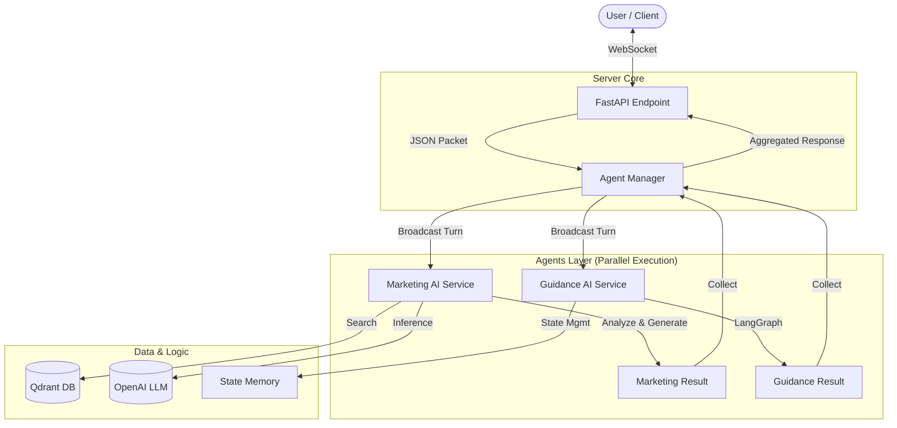

# System Architecture & Workflow

## 🌟 Overview
현재 시스템은 **단일 웹소켓 연결(Single WebSocket)**을 통해 **여러 AI 에이전트(Multi-Agent)**가 동시에 협업하는 **"Orchestrator Pattern"**으로 업그레이드되었습니다.

### 핵심 컴포넌트
1.  **FastAPI (Server)**: 웹소켓 연결 및 요청 처리의 진입점
2.  **Agent Manager (Orchestrator)**: 여러 에이전트에게 메시지를 뿌리고 결과를 모으는 중앙 통제소
3.  **Guidance AI (Agent 1)**: 상담/가이드 전용, LangGraph 기반의 상태 관리 에이전트
4.  **Marketing AI (Agent 2)**: 세일즈/마케팅 전용, 자체 세션 로직을 가진 에이전트

---

## 🎨 Architecture Diagram



---

## 🔄 Execution Workflow (상세 흐름)

### 1. 연결 (Connection)
*   **클라이언트**가 `ws://.../agent/check`에 연결합니다.
*   **FastAPI**는 고유 `session_id`를 생성하거나 클라이언트가 보낸 `callId`를 사용합니다.
*   `AgentManager`에 등록된 에이전트들(`Marketing`, `Guidance`)이 대기 상태에 들어갑니다.

### 2. 대화 발생 (User Speaks)
*   사용자가 말을 하면(`transcript`), **FastAPI**는 이를 JSON 객체로 포장하여 `AgentManager.process_turn()`을 호출합니다.

### 3. 동시 처리 (Parallel Processing)
`AgentManager`는 등록된 **모든 에이전트 함수를 동시에(Async)** 호출합니다.

#### A. Marketing AI (`marketing_service.py`)
1.  **세션 확인**: `_sessions` 딕셔너리에서 해당 `session_id`의 `MarketingSession`을 찾거나 새로 만듭니다.
2.  **분석 (Gatekeeper -> LLM)**:
    *   욕설/비속어 필터링 (Gatekeeper)
    *   Qdrant에서 상품/약관 검색 (RAG)
    *   LLM이 마케팅 기회(Upsell/Retention) 판단
3.  **결과 반환**: 마케팅 제안 멘트가 있다면 `recommended_answer`에 담아 반환, 없으면 `skip`.

#### B. Guidance AI (`guidance_service.py`)
1.  **LangGraph 실행**: 메시지를 `Graph State`에 추가합니다.
2.  **Node 실행**:
    *   `Analyze`: 검색 필요 여부 판단
    *   `Retrieve`: 필요 시 매뉴얼 검색
    *   `Generate`: 상담 가이드 생성
3.  **결과 반환**: 가이드 멘트를 반환, 없으면 `skip`.

### 4. 결과 집계 및 전송 (Aggregation & Response)
*   `AgentManager`는 두 에이전트의 작업이 끝날 때까지 기다립니다. (비동기 병렬 처리)
*   유효한 결과(Not Skip)가 취합되면 리스트 형태로 **FastAPI**에 돌려줍니다.
*   **FastAPI**는 이를 최종적으로 클라이언트에게 전송합니다.

```json
// 클라이언트가 받는 응답 예시
{
  "type": "result",
  "turn_id": 1,
  "results": {
    "agent_type": "marketing",
    "recommended_answer": "고객님, 지금 요금제를...",
    "work_guide": "Marketing Type: upsell"
  }
}
```

---

## 📂 Folder Structure (Refactored)

```text
app/
├── api/v1/endpoints/
│   └── agent.py           # [Entry] 통합 웹소켓 엔드포인트
│
├── services/
│   ├── agent_manager.py   # [Core] 오케스트레이터 (방송국)
│   ├── marketing_service.py # [Adapter] 마케팅 AI 연결 서비스
│   └── guidance_service.py  # [Adapter] 가이드 AI 연결 서비스
│
└── agent/
    ├── marketing/         # [Marketing AI Logic] (구 src 폴더)
    │   ├── session.py     # 세션 및 메인 로직
    │   ├── consumer.py    # 데이터 소비 로직
    │   └── ...
    │
    └── guidance/          # [Guidance AI Logic]
        ├── graph.py       # LangGraph 정의
        ├── nodes.py       # 실행 노드들
        └── ...
```
